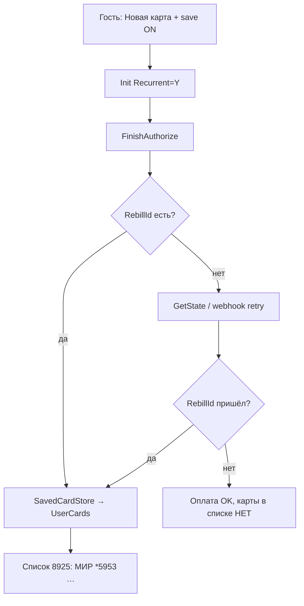

# UserCards — как работает привязка карты (save_card)

**ТЗ:** [`Исправление сохранения карты…`](../requirements/customer_tasks/Исправление%20сохранения%20карты%20в%20UserCards%20после%20успешной%20оплаты.md)  
**UI-канон списка:** [`1000008925_payment_methods_list.png`](../artifacts/usercards_save_card/screenshots/1000008925_payment_methods_list.png)  
**Связано:** [`PAYMENT.md`](PAYMENT.md) · оплата Т-Банк · **не путать** с привязкой карты.

---

## Главное одной фразой

**Оплата прошла** = заказ `accepted`, деньги списаны.  
**Карта в списке** = в БД есть строка в `mobile_payment_methods` с **RebillId** (`card_token`).  
Это **два разных итога** — второе без RebillId **невозможно**.

---

## Цепочка «Новая карта» + тумблер save ON

```
Checkout → POST /shop/api/payments/new_card (save_card: true, CardData RSA)
  → NewCardPaymentService
      1. payment.provider_data["save_card"] = true
      2. TbankAdapter#init_payment(recurrent: true)   ← Recurrent=Y в Init
      3. FinishAuthorize(CardData)
      4. CONFIRMED → SavedCardStore (если RebillId в ответе)
         иначе → TbankPaymentSync (GetState)
  → webhook POST /callbacks/tbank (CONFIRMED + RebillId)
      → TbankCallbackJob perform_now → SavedCardStore
  → mobile_payment_methods (UserCards): pan *XXXX, card_token = RebillId
  → GET /shop/api/user/cards → PaymentMethodsSheet (макет 8925)
```



---

## Где в коде

| Шаг | Файл |
|-----|------|
| API | `app/controllers/shop/api/payments_controller.rb` → `new_card` |
| Оркестрация | `app/services/shop/new_card_payment_service.rb` |
| Init + Recurrent | `app/services/payments/tbank_adapter.rb` |
| Запись карты | `app/services/payments/saved_card_store.rb` |
| Webhook | `app/controllers/callbacks/tbank_controller.rb` → `TbankCallbackJob` |
| Догон GetState | `app/services/payments/tbank_payment_sync.rb` |
| Список UI | `app/controllers/shop/api/user_cards_controller.rb` · `PaymentMethodsSheet.svelte` |
| БД | таблица `mobile_payment_methods` (= UserCards в ТЗ) |

---

## Условия «карта появилась в списке»

| # | Условие | Если нет |
|---|---------|----------|
| 1 | `save_card: true` в intent (`provider_data`) | persist пропускается |
| 2 | Статус **CONFIRMED** | карта не пишется |
| 3 | **RebillId** от Т-Банка (FA, GetState или webhook) | **типичный баг** — оплата OK, списка нет |
| 4 | `SavedCardStore` без ошибки | смотреть лог `UserCards persist failed` |

**1 клик** по уже сохранённой карте: `OneClickPaymentService` — RebillId уже в БД, новая привязка не нужна.

---

## Диагностика на Fly (read-only)

| Команда | Зачем |
|---------|--------|
| `ruby bin/usercards_fly_diagnose.rb` | сводка карт / последние tbank payments |
| `ruby bin/usercards_fly_payment_investigate.rb` | платежи за сегодня: Pan, RebillId по email |

**Пример инцидента 2026-07-16:** платёж `8866531465` — **succeeded**, `save_card: true`, **Pan/RebillId nil** → карта не в списке. Платёж `8866059239` — Pan *5953 + RebillId → карта есть.  
Артефакт: [`usercards_fly_payment_investigate_2026-07-16.json`](../artifacts/usercards_save_card/usercards_fly_payment_investigate_2026-07-16.json).

---

## Что НЕ считается привязкой

| Ситуация | Карта в 8925? |
|----------|----------------|
| Replay webhook с RebillId (0₽, без новой оплаты) | Да — но это **тест persist**, не E2E новой карты |
| Оплата succeeded без RebillId | **Нет** |
| `SHOP_SIMULATE_PAYMENT=1` | nonPCI/new_card заблокирован |

---

## Следующие шаги (Фаза 3 — RebillId)

1. ~~Runbook (этот файл)~~ **`[x]`**
2. ~~Root cause Fly 8866531465~~ **`[x]`** — `usercards_fly_payment_root_cause_2026-07-18.json`
3. ~~Retry GetState~~ **`[x]`** — `TbankPaymentSync#sync_for_rebill!` (5×, `TBANK_REBILL_SYNC_*`); log `[UserCards] missing RebillId payment_id=…`
4. Deploy + реальная новая оплата → 2+ карты в списке.
5. Апрув заказчика.
