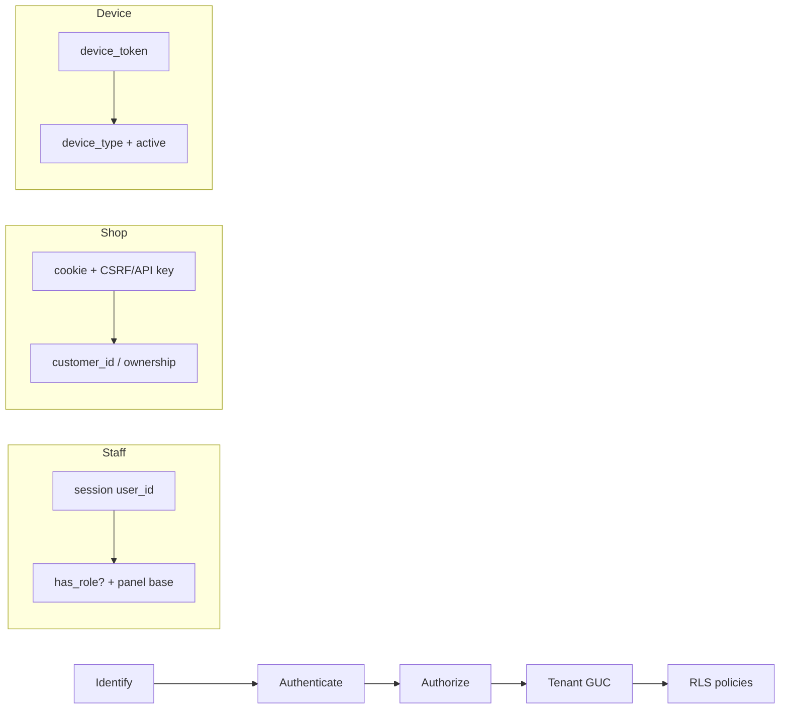

# IB-0-1 — Актёры и модели доступа

**Фаза:** 0 (baseline) · **Код не менялся** · дата: 2026-08-30 · DoD: [ROLES_AND_PERMISSIONS.md](../ROLES_AND_PERMISSIONS.md)

## Кратко: три модели доступа

| Модель | Кто | AuthN | AuthZ | Tenant | RLS |
|--------|-----|-------|-------|--------|-----|
| **Staff RBAC** | `User` (сотрудники) | session `user_id` + пароль | роль → панель (`has_role?`) | `user.tenant_id` или `session[:manager_tenant_id]` (UK/franchise) | `SET LOCAL app.current_tenant_id` + `app.current_user_id` |
| **Shop ownership** | `MobileCustomer` (гость/клиент) | cookie-сессия + OTP | `customer_id` в сессии, не staff-RBAC | `X-Shop-Tenant` / `tenant_id` / default env | `with_shop_tenant!` → GUC в транзакции |
| **Device token** | `Device` (kiosk, TV) | `X-Device-Token` / URL token | тип устройства + `is_active` | из записи `devices.tenant_id` | lookup: `app.device_token_lookup` GUC + `rls_devices_token_lookup`; далее GUC |
| **Webhooks** | внешние провайдеры | подпись / shared token | нет пользователя | из payload / payment.tenant_id | в job/service по tenant заказа |

**Staff ≠ Customer:** `User` и `MobileCustomer` — разные сущности, разные сессии, разные панели. Shop API не использует `User` / Pundit staff.

---

## Цепочка доступа



ASCII (эквивалент):

```
identify → authenticate → authorize (role / ownership) → tenant GUC → RLS
```

---

## Таблица актёров

| Actor | Entity | AuthN | AuthZ model | Tenant | Entry (panel/API) | RLS (GUC) | Notes |
|-------|--------|-------|-------------|--------|-------------------|-----------|-------|
| **barista** | User | session + password | RBAC: `has_role?("barista")` | `user.tenant_id` | `/barista/*` | `app.current_tenant_id`, `app.current_user_id` | FeatureFlag `barista`; Pundit на orders |
| **shift_manager** | User | session + password | RBAC: `has_any_role?(shift_manager, …)` | `user.tenant_id` | `/manager/*` | GUC | Без Персонал/Устройства (Prog10); `skip_authorization` на base |
| **general_manager** | User | session + password | RBAC | `user.tenant_id` | `/manager/*` | GUC | Staff management, devices; Pundit на staff/menu |
| **franchise_manager** | User | session + password | RBAC + org scope | `session[:manager_tenant_id]` ∈ org | `/manager/*` + switcher | GUC | Только tenants `organization_id`; без staff UI |
| **prep_kitchen_manager** | User | session + password | RBAC | `user.tenant_id` (отдельный tenant цеха) | `/prep_kitchen/*` | GUC | FeatureFlag `prep_kitchen`; policies в коде есть, `skip_authorization` |
| **prep_kitchen_worker** | User | session + password | RBAC | `user.tenant_id` | `/prep_kitchen/*` | GUC | Только чтение движений (policy) |
| **ук_global_admin** | User | session + password | RBAC: `uk_global_admin?` | platform: без tenant; manager: `session[:manager_tenant_id]` | `/admin/*`, `/manager/*` (после выбора точки) | GUC user_id на platform; tenant в manager | `open_as_manager` → manager context |
| **blog_editor** | User | session + password (blog login) | RBAC: `has_role?("blog_editor")` | optional / не привязан к точке | `/blog/*` | минимальный / без staff GUC | Отдельный layout; публичный блог + draft для editor |
| **shop_guest** | — (аноним) | cookie + CSRF referer **или** `SHOP_API_KEY` | tenant only | resolved shop tenant | `/shop/api/*` | GUC в `with_shop_tenant!` | Корзина, каталог, OTP до верификации |
| **shop_customer** | MobileCustomer | cookie `CustomerSession` после OTP | ownership `customer_id` | per-tenant customer | `/shop/api/*` | GUC | Profile, history, cards — scoped by customer |
| **kiosk_device** | Device (`kiosk`) | `X-Device-Token` | device active + token_valid? | `device.tenant_id` | `POST /kiosk/api/auth` → shop API | lookup RLS off; затем GUC | Flutter киоск; дальше shop API с tenant header |
| **tv_board** | Device (`tv_board`) | URL `?token=` | device active | `device.tenant_id` | `GET /tv_board` + ActionCable cookie | GUC | Заказы tenant в статусах accepted/preparing/ready |
| **tbank_webhook** | — | `Payments::TbankAdapter.verify_notification` | signature Token | из Order/Payment в job | `POST /callbacks/tbank` | в job по order | Idempotency cache 24h |
| **sms_ru_webhook** | — | `Callbacks::SmsRuWebhook` hash | HMAC hash | не привязан к tenant в HTTP | `POST /callbacks/sms_ru` | — | Ответ `100` обязателен |
| **email_bounce** | — | `X-Webhook-Signature` HMAC | shared secret | по OrderEmail | `POST /callbacks/email/bounce` | — | Обновляет `order_emails.status` |
| **generic_callback** | — | `X-Callback-Token` + optional HMAC | EventsController | `params[:tenant_id]` | `POST /callbacks/payments`, `/fiscal_receipts` | scope Payment/FiscalReceipt | Anti-replay timestamp, idempotency key |
| **background_job** | — | Solid Queue / ActiveJob | internal | из аргументов job / order | — | в service: `SET LOCAL` или `ApplicationRecord.with_tenant` | Нет HTTP actor |
| **health_monitor** | User (UK) или LB | session UK **или** none | `require_uk_global_admin` / public `/up` | global | `GET /up`, `GET /health/tenants` | UK: user_id GUC | `/up` — Rails health, без auth |

---

## Staff vs Customer

| | Staff (`User`) | Customer (`MobileCustomer`) |
|--|----------------|----------------------------|
| Таблица | `users` | `mobile_customers` |
| Логин | `/login` → staff panels | OTP phone/email в shop |
| Сессия | `session[:user_id]`, `session[:role_code]` | `Shop::CustomerSession` per tenant |
| Авторизация | Pundit + role gates в base controllers | ownership `customer_id`, `order_visible_to_session_customer?` |
| RLS user GUC | `app.current_user_id` | не устанавливается |
| Пересечение | нет общего login flow | киоск использует shop API, не staff |

---

## Детали по группам

### Staff panels

- **ApplicationController:** Pundit, `set_pg_context`, `rescue_from Pundit::NotAuthorizedError`
- **Barista:** `require_barista_role`, `Current.role_code = "barista"`, module flag
- **Manager:** `require_manager_role` (GM/SM/franchise/UK), franchise tenant switcher, UK requires `manager_tenant_id`
- **Prep kitchen:** отдельный tenant (цех ≠ точка продаж); роли manager/worker
- **Platform (UK):** только `ук_global_admin`; RLS только `user_id` без tenant на platform pages
- **Blog:** `blog_editor` — CMS блога, не coffee shop ops

Post-login redirect: `Auth::SessionsController#dashboard_path_for_role` — barista→`/barista`, managers→`/manager`, UK→`/admin`, prep→`/prep_kitchen`, blog→`/blog`.

### Shop

- **Base:** `Shop::Api::BaseController` — `with_shop_tenant!`, `Auth` module
- **Auth gate:** browser = Referer `/shop` + `X-CSRF-Token`; иначе `X-Shop-Api-Key` = `ENV["SHOP_API_KEY"]`; test env skip
- **Исключение:** `categories#index` — `skip_before_action :authenticate_shop_api!`

### Devices

- **Kiosk:** `Kiosk::Api::AuthController` — unscoped device lookup, then tenant GUC
- **TV:** `TvBoardsController#show` — token in query; cookie `tv_device_token` for ActionCable
- **Cable:** `ApplicationCable::Connection` — user session OR tv cookie OR nil (guest channels use reconnect_token)

### Webhooks / callbacks

| Endpoint | Auth |
|----------|------|
| `/callbacks/tbank` | T-Bank notification Token |
| `/callbacks/sms_ru` | SMS.ru hash |
| `/callbacks/email/bounce` | HMAC `X-Webhook-Signature` |
| `/callbacks/payments` | `CALLBACK_SHARED_TOKEN` + HMAC + timestamp + idempotency |

---

## Known gaps → Phase 4 status

**DoD doc:** [ROLES_AND_PERMISSIONS.md](../ROLES_AND_PERMISSIONS.md) · **GAP REGISTER:** [phase_4_rbac_dod/README.md](../phase_4_rbac_dod/README.md)

### Закрыто (Phase 1–3)

1. ~~Shop payments без ownership~~ — **FIXED** Phase 1 (`OrderOwnership` concern)
2. ~~`User#has_role?` без tenant~~ — **FIXED** Phase 2 (`has_role_in_context?`)
3. ~~Manager critical CRUD без Pundit~~ — **FIXED** Phase 2 (staff, devices, shifts, orders, menu, finance, prep)
4. ~~Franchise/UK tenant escape~~ — **OK** Phase 3 tests

### Documented backlog / exceptions (не блокер «контур закрыт»)

5. **Platform** — policies exist, controllers без full Pundit rollout
6. **Prep kitchen** — `skip_authorization` on base; movements/inventory opt-in Pundit
7. **Franchise manager** — staff UI blocked (`staff_management_visible?` = GM \| UK); devices allowed
8. **Shop guest flows** — `pending_order` / `reconnect_token` by design
9. **Favorites** — session-only (P3 backlog)
10. **Categories index** — public without API key (SEO)
11. **Debug endpoint** — non-production only
12. **Background jobs** — audited Phase 3; patterns documented in RLS_TENANT_AUDIT
13. **blog_editor** — отдельный CMS-контур
14. **ActionCable guest** — channels verify reconnect_token
15. **RLS bypass** — kiosk/TV/cable device lookup → [Phase 3 audit](../phase_3_tenant_rls/RLS_TENANT_AUDIT.md) (**BACKLOG**)
16. **NEED_MIGRATION:** none (2026-08-30)

---

## Источники (read-only)

`application_controller.rb`, `barista/manager/prep_kitchen/platform/shop/api base_controller`, `shop_api_auth.rb`, `kiosk/api/auth_controller.rb`, `tv_boards_controller.rb`, callbacks controllers, `application_cable/connection.rb`, `config/routes.rb`, `prog10_rbac_matrix.md`.
